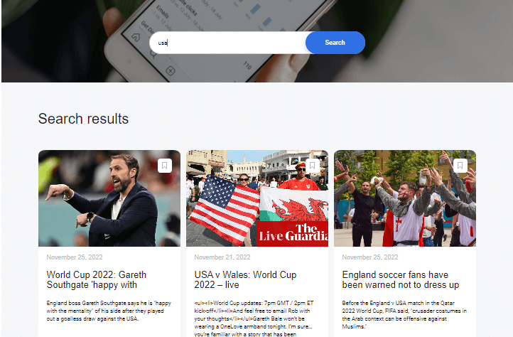

# My Final Project

[App](https://ori-hemo.students.nomoredomainssbs.ru/) 🔗

### About the Project: 📚

Application for searching articles and saving them on user account.

### Features 🟡

- When the user enters a keyword in the search bar, the website send a request to the News API service, find all the relevant articles over the last week, and display a list of cards for each of them.

- saved news page display all articles saved by a user.

API service — https://newsapi.org

### Screenshots 🟢

### Deployment 🔵

Google cloud with Ubuntu 20.04 LTS VM.

## Back End

the server responsible for authorization and storing articles.

### Routes 🔴

- GET /users/me - returns information about the logged-in user

- GET /articles - returns all articles saved by the user

- POST /articles - creates an article with the passed keyword, title, text, date, source, link, and image in the body

- DELETE /articles/articleId - deletes the stored article by \_id

- POST /signup - creates a user with the passed email, password, and name in the body

- POST /signin - checks the email and password passed in the body and returns a JWT

### Technologies 🟠

Mongo DB, Express and Node.js.

## Front End

⚛️ react application (using CRA)

💻📱 Responsive layout

🔒 protected route - saved news page (only for users)

using BEM Methodology for class name.

### The front end of the website consists of two pages:

1. The main page with a search box
2. The page with saved news items where all the liked materials are displayed

Additionally, the website has two popup windows:

- A registration form
- A login form

If the user has closed the tab and then returned to the site, the data will be accessible by interaction with local storage and the state variable.

### Technologies 🟣

technologies implemented are React, React-Router v6, JSX, and CSS.

### About the work process ✏️

This was a 3 week long project built during my last part at Practicum bootcamp. Project goals included using technologies learned up during the cours.

Thank you for staying with me up to this point ❤ .
Suggestions and feedbacks are always welcomed.😃
